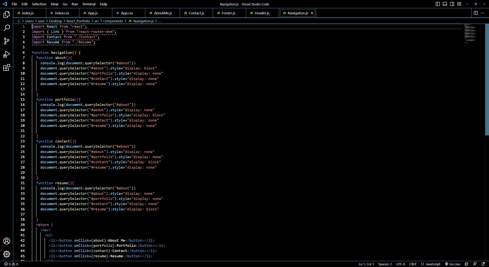

## React Portfolio

This repo contains a React App that i made to reflect my progress and achievements so far in the UofM Full Stack Web Development Coding Bootcamp. It has multiple segments about myself and some projects that I have completed.

# Screenshots

# GitHub Repository

https://github.com/Ervin543/React_Portfolio

# Deployed Application

https://ervin543.github.io/React_Portfolio/
